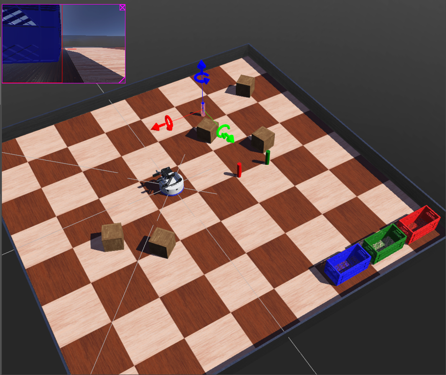

**Robots World**

**Project:**
- **Description:** A small robots-world simulation implemented in the repository. The simulation is driven by the main script at [grasping.py](grasping.py).

**Preview:**
- Image above shows the robots' environment and a sample scene from the simulation.

**Requirements:**
- **Python:** 3.8+
- **Webots**

**Run:**
- **Run Command:** `python grasping.py`

**Files:**
- **Main Script:** [grasping.py](grasping.py)

